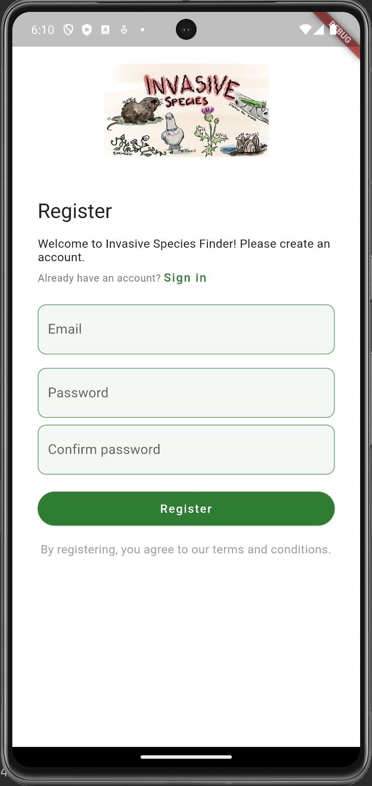
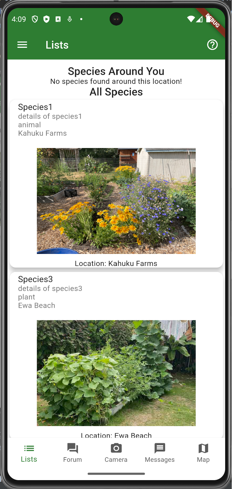
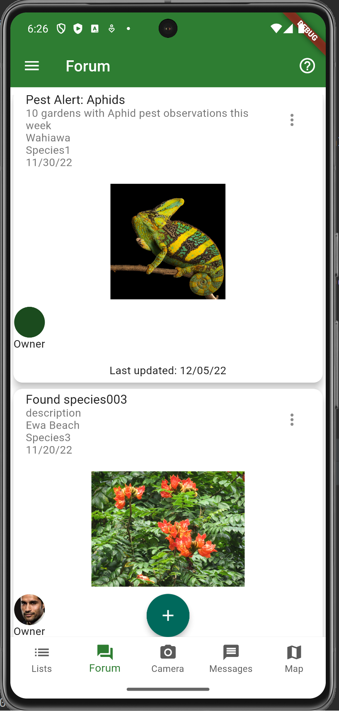
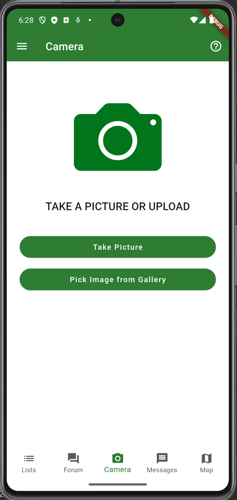
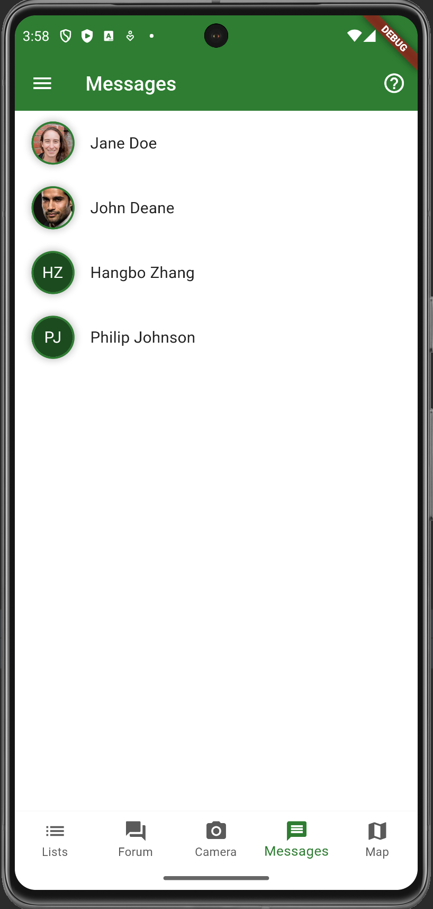
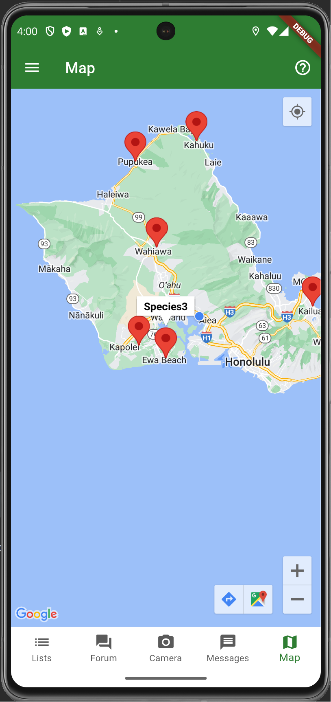

# Invasive Species Finder

## Table of contents

* [Motivation](#motivation)
* [Goals](#goals)
* [Usage](#usage)
* [Installation](#installation)
* [Development Status](#development-status)
* [About us](#about-us)

## Motivation
Hawaiian ecosystems are under high level of threat from numerous invasive
species from all over the world. Invasive species are a major threat to endangered species and native ecosystems. They compete with native species for resources, and can even prey on native species directly. Invasive species can also introduce new diseases to
the island and cause serious damage to the ecosystem or human beings.

## Goals
1. Geotagged photos of invasive species are collected from the public to pinpoint the location.
2. users share photos to check if a species is invasive or not either by the AI or experts.
3. create a community of people who are interested in finding and cleaning up invasive species.

## Usage

### 1. Login page


Users can login with their account using the Email and Password they created. Sign up link will lead to the sign up page. Forgot password link will lead to the reset password page. Sign up link will take user back to the sign in page to login.

### 2. Sign up page



Users can sign up by entering their Name, Email, password, and phone number. The password must be at least 6 characters long.

### 3. Drawer


The drawer contains the user's profile picture, name, and email. And it has the links to the homepage,
post page (which contains all the posts posted by the user), and the logout button. (there will be more added into the
drawer in the future)

### 4. Post page


The post page shows all the posts that have been posted by the user.

### 5. List page



The list page shows all the invasive species that have been reported by the users or added by admin and grouped them 
into 3 categories. Users can click on the categories to get into the detailed list of that category.

### 6. Forum page



The forum page shows all the posts that have been posted by the users. 
Users can click on the post to get into the detailed post page.

### 7. Camera page



The camera page allows users to take a picture of the invasive species and upload it to the database.

### 8. Message page



The message page shows all the messages that have been sent by the users.

### 9. Map page



The map page shows all the invasive species that have been reported by the users or added by admin on the map.


## Installation

After downloading, cd into the directory and invoke:

```
flutter run
```
On my platform, that brings up the iOS simulator and the following:

```
% flutter run
Launching lib/main.dart on iPhone 13 Pro in debug mode...
Running Xcode build...                                                  
 └─Compiling, linking and signing...                         3.2s
Xcode build done.                                           14.4s
[VERBOSE-2:FlutterDarwinContextMetalImpeller.mm(37)] Using the Impeller rendering backend.
Syncing files to device iPhone 13 Pro...                           119ms

Flutter run key commands.
r Hot reload. 🔥🔥🔥
R Hot restart.
h List all available interactive commands.
d Detach (terminate "flutter run" but leave application running).
c Clear the screen
q Quit (terminate the application on the device).

A Dart VM Service on iPhone 13 Pro is available at: http://127.0.0.1:63610/L5Qxu9BkbG0=/
The Flutter DevTools debugger and profiler on iPhone 13 Pro is available at:
http://127.0.0.1:9101?uri=http://127.0.0.1:63610/L5Qxu9BkbG0=/
```

## Development Status

Project Board: [https://github.com/orgs/invasive-species/projects/2](https://github.com/orgs/invasive-species/projects/2)

## About us

***Hangbo Zhang:*** 

Graduate student in Computer Science at University of Hawaii at Manoa. 

Email: [hangbo@hawaii.edu](mailto:hangbo@hawaii.edu)

Portfolio: [https://hangbozhang.github.io/](https://hangbozhang.github.io/)

***Moseli Motsoehi:*** 

PhD student in Computer Science at University of Hawaii at Manoa.

Email:

Portfolio:
